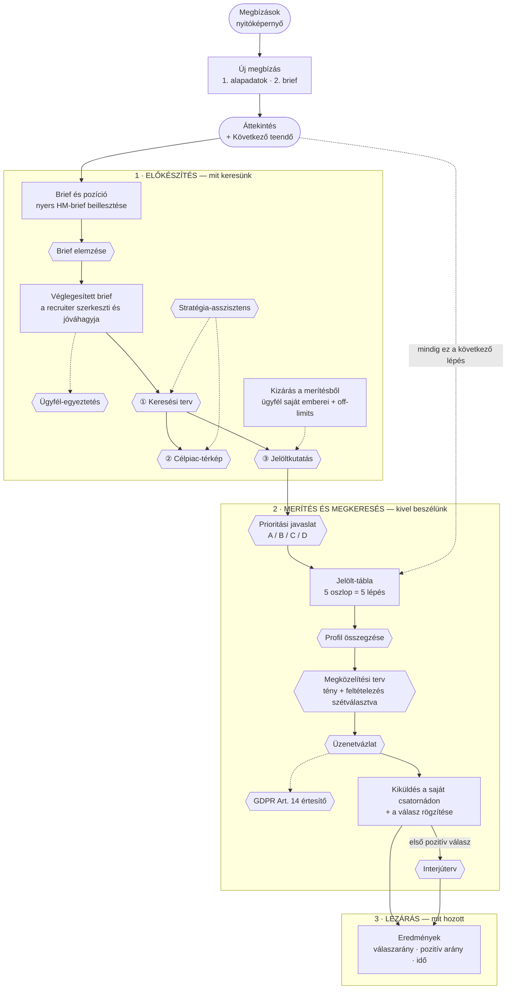
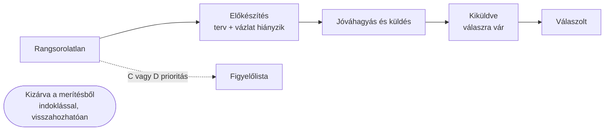

# JEL — a folyamat: mi mit csinál

> Ez a dokumentum az **igazság-forrás** a termék folyamatáról: mit csinál a recruiter, mit csinál a rendszer, és hol dől el, hogy valami tény vagy feltételezés.
> Vizuális, ügyfélnek mutatható változat: [`folyamatabra.html`](./folyamatabra.html) (nyisd meg böngészőben).
> A súgó- és GYIK-terv, ami erre épül: [`HELP-FAQ-TERV.md`](./HELP-FAQ-TERV.md).

---

## 1. Egy mondatban

A JEL egy **megbízás-alapú munkatér**: egy megbízás = egy ügyfél egy konkrét pozíciója, és a rendszer végigvezet a nyers brieftől a rögzített válaszig — de **minden döntési ponton a recruiteré az utolsó szó**.

## 2. A három réteg

| Réteg | Ki csinálja | Mit jelent |
|---|---|---|
| **Munka** | a recruiter | brief beillesztése, véglegesítés, prioritás felülbírálása, kiküldés, válasz rögzítése |
| **Elemzés** | 11 AI-képesség (`core/capabilities.js`) | javaslatot állít elő — soha nem lép a recruiter helyett |
| **Kutatás** | Reach Engine (`core/reach/`) | publikus webes keresés + a scrapelhető oldalak mély olvasása, normalizált jelölt-rekordokká |

Kiegészítő rétegek, amiket a felhasználó nem lát közvetlenül, de a viselkedést ezek határozzák meg: **guardrailek** (evidencia-földelés, elszámoltathatóság, PII-minimalizálás), **audit-napló**, és a **Knowledge Core** (a szakmai tudásbázis, ami a szerveren marad).

---

## 3. A folyamatábra

**Jelmagyarázat:** `⬡ hatszög` = AI-lépés (javaslatot ad) · `▭ téglalap` = a recruiter munkája vagy a felület állapota · `( ) lekerekített` = belépési pont · **szaggatott nyíl** = opcionális vagy oldalirányú kapcsolat.

### A jelölt állapot-létrája

Egy jelölt mindig pontosan egy állapotban van. A Jelöltek nézet öt oszlopa ez a létra — nincs külön „megkeresések” képernyő, mert a megkeresés a jelölt tulajdonsága, nem külön munkafolyamat.

### Tény, következtetés, feltételezés

A felület három különböző címkével jelöli, honnan jön egy állítás. Ez nem dekoráció: ez a termék központi ígérete.

| Címke | Mit jelent | Hol jelenik meg |
|---|---|---|
| **Forrással igazolt** | publikus forrásból származó, hivatkozható jel | jelölt-jelek, „Amit tudunk” blokk |
| **Következtetés** | a jelekből levezetett, de nem szó szerint kiolvasott állítás | profil-összegzés |
| **Ellenőrizendő feltételezés** | nyíltan hipotézis, a rendszer nem tudja | megközelítési ötletek, feltételezett igények |

---

## 4. Lépésről lépésre — mi mit csinál

Minden lépésnél: **mit csinál** · és ahol nem nyilvánvaló, **miért így**.

### 4.1 Megbízások (nyitóképernyő)

Itt élnek a megbízásaid: egy megbízás egy ügyfél egy konkrét pozíciója, nem egy általános „projekt”. A kártya mutatja a státuszt, a tölcsért (felkutatva · prioritásos · megkeresve · válaszolt) és a **kiemelt következő teendőt**. A szűrők (Aktív / Figyelmet igényel / Várakozik / Lezárt) azt válaszolják meg, mibe kell ma belenyúlni.

> **Miért így:** a „figyelmet igényel” nem hangulat, hanem szabály — akkor jelenik meg, ha prioritásos jelöltnél hiányzik a terv vagy a vázlat, vagy ha egy kiküldött megkeresés napok óta válasz nélkül áll.

### 4.2 Új megbízás (2 lépés)

Először az alapadatok (pozíció és ügyfél kötelező, a többi opcionális), utána a nyers brief — a briefet később is beillesztheted. Az **ügyfél neve nem formalitás**: ez vezérli a kizárási motort és kerül be negatív szűrőként a keresési lekérdezésekbe.

### 4.3 Áttekintés — „Következő teendő”

Egyetlen kiemelt lépés megbízásonként, alatta a legfeljebb 5 elakadt jelölt, mindegyik egy kattintással elintézhető. A szabályok sorrendben értékelődnek, az első találó nyer: nincs brief → elemzés → véglegesítés → terv → kutatás → prioritás → hiányzó terv/vázlat → jóváhagyás → kiküldés → utánkövetés → válasz rögzítése.

> **Miért új:** nem dashboard, hanem **munkasor**. Nem azt mutatja, mi történt, hanem azt, mi a következő mozdulat — így a felület nem kényszerít sorrendet, de mindig van egy javasolt lépés.

### 4.4 Brief elemzése

A hiring manager nyers briefjéből javasolt **pozíció-összefoglalót** készít, és szétszedi: elengedhetetlen feltételek, előnyt jelent, tisztázandó pontok, feltételezett igények, keresési hipotézisek. A „tisztázandó pontok” a brief ellentmondásait, hiányait és fölösleges megkötéseit szedik össze — ezekkel mész az ügyfélhez.

> **Miért új:** nem összefoglal, hanem **kérdez**. A tisztázandó pont és a feltételezett igény külön blokkban van, mert az egyik a hiring managernek szóló kérdés, a másik a rendszer saját, ellenőrizendő találgatása.

### 4.5 Véglegesített brief

Az AI-javaslatból indul, de **te szerkeszted**, és a te változatod az, ami továbbmegy a keresésbe, a megkeresésekbe és az ügyfél-egyeztetésbe. A szövegmező és a két feltétel-lista szabadon módosítható, a „Véglegesítés és jóváhagyás” rögzíti; az AI eredeti javaslata külön kártyán megmarad összehasonlításra.

> **Miért új:** itt válik el a **javaslat** a **döntéstől**. Minden későbbi lépés a véglegesített briefre épül, nem az AI kimenetére — ezért lehet a rendszernek határozott véleménye anélkül, hogy elvenné a recruiter felelősségét.

### 4.6 Pozícióadatok

Tíz strukturált mező (helyszín, munkavégzés, szint, hiring manager, nyelv, bérsáv, céldátum, felelős). Ezek kontextusként minden AI-hívásba bekerülnek, és a fejlécben is látszanak. Bármikor módosíthatók.

### 4.7 Ügyfél-egyeztetés

Felkészít a hiring managerrel való beszélgetésre: egyeztetési pontok, mit vigyél magaddal (piaci adat, kockázat), és folyamat-kockázatok. Akkor a leghasznosabb, ha a **kutatás előtt** futtatod, mert ilyenkor még alakíthatók a feltételek.

### 4.8 Célpiac ① — Keresési terv

Ez a kutatás alapja: célpozíciók, célcégek, kulcs-szinonimák, boolean/X-ray lekérdezések és a webes kereső-lekérdezések, amik az élő kutatást vezérlik. Minden kategória szerkeszthető — hozzáadhatsz és elvehetsz. A terv **frissítése egyesít, nem töröl**: a kézzel felvett elemeid megmaradnak, és amit kézzel kivettél, azt a frissítés nem hozza vissza.

> **Miért új:** az AI-terv itt nem végleges kimenet, hanem **közös munkadarab**. A „mit vettem ki kézzel” memóriája nélkül minden újragenerálás visszahozná a recruiter által elvetett ötleteket — ez a leggyakoribb ok, amiért az emberek abbahagyják az ilyen eszközök használatát.

### 4.9 Célpiac ② — Célpiac-térkép

Megmutatja, **hol dolgoznak** a szerephez illő emberek: célcégek indoklással és valószínű szerepekkel, versenytárs-klaszterek, és hol találkoznak (közösségek, konferenciák). A keresési terv után élesedik, mert abból dolgozik. Ez a térkép adja a „célcég-lefedettség” alapját az Áttekintésen.

### 4.10 Kizárás a merítésből

Az ügyfél **jelenlegi és volt munkatársai** automatikusan kimaradnak a jelöltlistából, a cégnév-egyezés a leányvállalati és rövidített alakokat is felismeri. Felvehetsz további off-limits cégeket és az ügyfél alternatív cégneveit, az alumnikat pedig egy kapcsolóval visszaengedheted.

> **Miért új:** a kizárás **nem törlés**. A találat megmarad, indoklással, külön sávon, és egy kattintással visszahozható — mert a néma törlés is bizalomvesztés. A szabály maga viszont kemény: ha az ügyfél saját embere kerül a listára, az az egész merítés hitelét viszi.

### 4.11 Stratégia-asszisztens

Szűk hatókörű chat: **kizárólag** a keresési tervet és a célpiac-térképet módosítja, tételes és visszavonható műveletekkel („+ hozzáadva”, „− elvéve”). Ha kérdezel, nem hajt végre semmit, hanem javaslatokat ad, amiket egyenként alkalmazhatsz. Jelöltet nem értékel és üzenetet nem ír — ezekre átirányít.

> **Miért új:** ez nem általános asszisztens. A rendszer-promptja megnyitható a felületen, hogy **látszódjon, mit tud és mit nem** — a szűk hatókör az, ami visszavonhatóvá és ellenőrizhetővé teszi.

### 4.12 Célpiac ③ — Jelöltkutatás

A terv webes lekérdezéseivel keres a nyilvános weben, majd a ténylegesen elérhető oldalakat (GitHub, cég-oldal, konferencia-bio, blog, személyes site) mélyebben kiolvassa, és normalizált jelölt-rekordokká alakítja — jelekkel, forrás-hivatkozással és GDPR-státusszal. A forrás választható: automatikus / élő webes források / mintaadatok.

> **Fontos, és tudatos korlát:** **nincs belépett vagy fake-account LinkedIn-scraping.** A LinkedIn-találatok a keresőből jönnek, a profil-oldal auth-fal mögött van, így onnan csak a kereső-snippet marad. A valódi mélységet a scrapelhető publikus források adják — ezt a felület nem takarja el.
>
> **Ismételt futtatás:** nem írja felül a listát. Az új találatok hozzáadódnak „Új” jelöléssel, a névre egyező duplikátumok kimaradnak.

### 4.13 Keresési lefedettség (Áttekintés)

Két kérdésre válaszol: **egy forrásból jön-e minden** (ha a jelöltek 70%-a ugyanonnan, az vakfolt), és **hány célcég maradt érintetlenül**. Ha valamelyik hibázik, figyelmeztet, mielőtt a listából következtetnél.

> **Miért új:** a merítés minőségét a legtöbb eszköz nem méri, csak a darabszámot. Egy 40 fős lista egyetlen forrásból kevesebbet ér, mint egy 15 fős négy forrásból — ezt itt látod, nem utólag.

### 4.14 Prioritási javaslat (A / B / C / D)

Őszinte prioritási sor: A — elsőként keresd meg, B — következő kör, C — figyelőlista, D — most nem javasolt, mindegyik rövid indoklással. **Minden jelölt megjelenik** a rangsorban, akkor is, ha a javaslat elutasító — ezt guardrail kényszeríti ki. A prioritást bármikor felülírhatod, és a te beállításod győz.

> **Miért új:** kimondja, ha valaki nem fit. A legtöbb eszköz csak pozitív listát ad, és a gyenge jelölt némán eltűnik — itt nem esik ki senki, csak megkapja a D-t indoklással. Ez teszi a listát elszámoltathatóvá.

### 4.15 Jelölt-tábla és lista

Öt oszlop, ami maga a folyamat: Rangsorolatlan → Előkészítés → Jóváhagyás és küldés → Kiküldve → Válaszolt. Alatta a **Figyelőlista** (C és D) és a **Kizárva** sáv. Keskeny képernyőn automatikusan listává vált, a szűrők ugyanúgy hatnak.

> **Miért így:** korábban a megkeresés külön képernyőn élt, ezért ugyanaz a jelölt két helyen létezett, eltérő sorrenddel. Egy létra, egy hely.

### 4.16 Jelöltpanel · Profil

Egy jelölt minden adata egy helyen, négy fülre bontva. A Profil fülön a jelek erősség szerint, a forrás-link, a GDPR Art. 14 státusz, és a „Profil összegzése” — ami **őszinte illeszkedés-ítéletet** ad (erős / közepes / gyenge / nem fit) indoklással, plusz egy „amit nem tudunk” listát.

### 4.17 Jelöltpanel · Megközelítés

Két élesen elválasztott rész. **„Amit tudunk”**: csak a jelekből visszavezethető tény, mindegyik mellett a jel, amiből ered. **„Megközelítési javaslat”**: pontosan 3 ötlet rangsorolva, nyíltan feltételezésként jelölve — a legerősebb részletesen, nyitómondat-ötlettel, kettő röviden. Plusz csatorna, időzítés és kerülendő megközelítések.

> **Miért új — ez a termék lényege:** a jelölt motivációját nem ismerjük, tehát a megközelítés szükségszerűen hipotézis. A rendszer ezt **kimondja**, nem elrejti. Egy guardrail utólag kiszűri azokat az állításokat, amiket nem lehet a jelölt egyetlen jelére sem visszavezetni, és jelzi, hányat dobott — ez a második védővonal a prompt mögött.

### 4.18 Jelöltpanel · Üzenet

A megközelítési tervből személyre szabott üzenetvázlat készül: az első mondat a jelölt saját munkájához kapcsolódik. Szerkesztheted, jóváhagyhatod, másolhatod. Az állapotok — jóváhagyva → kiküldés rögzítve → válasz (pozitív / semleges / negatív) — a te rögzítéseid.

> **A rendszer soha nem küld semmit.** A kiküldés a te csatornádon történik (e-mail, LinkedIn), itt csak az állapotát tartod nyilván. Ez nem korlát, hanem termékdöntés: az automatizált kiküldés az, ami tömegessé és megkülönböztethetetlenné teszi a megkereséseket.

### 4.19 GDPR Art. 14 értesítő

Ha publikus forrásból kutatsz jelöltet, **adatkezelővé válsz**, és a 14. cikk szerint tájékoztatnod kell az érintettet. A gombra kész értesítő-sablon jön: adatkezelő, milyen adat, honnan, milyen célból, milyen jogalapon, és milyen jogai vannak. A jelölt profilján a státusz (`pending_notice` / `n/a`) mutatja, hol tartasz.

> **Miért van benne:** a scraping következménye nem opcionális extra. Az értesítő sablon — a cégadatokat és az érdekmérlegelést ki kell tölteni, és skálázás előtt jogásszal átnézetni.

### 4.20 Napló és módszertani segítség

A Napló (⌘J vagy az oldalsáv gombja) minden képernyőről elérhető: megbízás- és jelöltszintű jegyzetek, plusz a jelölt idővonala, ami a meglévő eseményekből áll össze — nincs külön eseménynapló. A „Módszertani segítség” egy javasolt megközelítést, egy azonnal bevethető lépést és egy készség-fókuszt ad arra, amit leírsz.

### 4.21 Interjúterv

Kompetencia-alapú kérdések: mit kérdezz, és mit jelez egy erős válasz, plusz a beszélgetésen tisztázandó jelek. **Az első pozitív válaszig zárolva** van — a negatív és a semleges válasz nem oldja fel.

> **Miért így:** amíg nincs pozitív válasz, nem tudni, kivel készül az interjú, tehát a terv találgatás lenne. A zárolás elmagyarázza, mire vár, ahelyett hogy üres képernyőt adna.

### 4.22 Eredmények

Kiküldött megkeresések, **válaszadási arány**, **pozitív válaszok aránya** külön mutatóként, a korábbi kézi válaszarányodhoz mérve. Plusz az első shortlistig eltelt idő és a folyamatban lévő A/B jelöltek száma. Minden szám a te rögzítéseidből épül — a rendszer nem küld, tehát kitalált számot sem mutat.

> **Miért külön a pozitív arány:** a „válaszolt” önmagában félrevezető, mert az elutasítás is válasz. A pilot elsődleges mérőszáma az, hány beszélgetés indul — ehhez a semleges válasz nem elég.

### 4.23 Módjelzők, export, adattárolás

Az oldalsáv és a fejléc mindig mutatja, milyen módban futsz: **AI elérhető** vagy **Bemutató mód**, illetve **nyilvános webes források** vagy **mintaadatok**. Bemutató módban a kimeneteken `MINTA` címke van. A megbízásaid **ebben a böngészőben** tárolódnak (a szerver állapotmentes), ezért a fontos munkát érdemes exportálni — a fejléc Export gombja teljes JSON-t ad.

---

## 5. Amit a rendszer tudatosan NEM csinál

| Nem csinálja | Miért |
|---|---|
| Nem küld üzenetet | a kiküldés a recruiter csatornáján és felelősségével történik |
| Nem scrapel belépett LinkedIn-t | ToS-bukó és ban-kockázat; a mélységet a publikus források adják |
| Nem utasít el automatikusan jelöltet | a fit-ítélet emberi döntést támogat, nem helyettesít |
| Nem ejt ki némán jelöltet a rangsorból | guardrail kényszeríti ki az elszámoltathatóságot |
| Nem állít kitalált tényt a jelöltről | evidencia-földelés: ami nem vezethető vissza jelre, kikerül |
| Nem kezel különleges kategóriájú adatot | PII-minimalizálás szűri a szövegből |
| Nem tárol szerveroldalon megbízás-adatot | a munka a látogató böngészőjében él |

---

## 6. Hogyan használd ezt a dokumentumot

- **Ügyfélbemutatón:** nyisd meg a [`folyamatabra.html`](./folyamatabra.html)-t — ugyanez az anyag egy képernyőn, kattintható lépés-magyarázatokkal.
- **Terméktervezésnél:** a 4. fejezet lépés-szövegei egy az egyben átemelhetők a felület súgójába — a [`HELP-FAQ-TERV.md`](./HELP-FAQ-TERV.md) pontosan ezt teszi meg, tile-onként lerövidítve.
- **Fejlesztésnél:** ha egy lépés viselkedése változik, **itt** írd át először, és onnan vezesd tovább a súgó-szövegbe.
